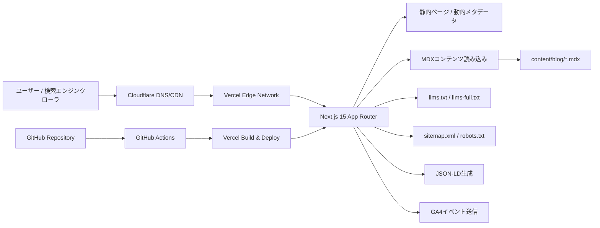

# アーキテクチャ設計書

## 1. 設計方針

- サイトは **Next.js 15 (App Router)** を採用し、トップページとブログをSSG中心で配信する。
- コンテンツ管理はCMSを使わず、`content/blog/*.mdx` をGit管理する。
- SEO最適化を最優先し、構造化データ・サイトマップ・robots・canonicalを全体設計に組み込む。
- 初期フェーズはサーバーサイドDBを持たない構成とし、必要になった時点でPostgreSQLを追加可能な構造にする。

## 2. システム全体構成



## 3. 技術スタック

| レイヤー | 技術 | バージョン目安 | 採用理由 |
|---|---|---|---|
| フロントエンド | Next.js | 15.x | App Router、SSG、Metadata API、sitemap/robots生成を標準化できるため |
| UI | React | 19.x | Next.js 15との整合性、コンポーネント分割しやすいため |
| 言語 | TypeScript | 5.x | ページ・メタデータ・MDX frontmatterの型安全性確保 |
| スタイリング | Tailwind CSS | 4.x | 既存LPデザインを保ちつつ保守しやすい設計に移行できるため |
| コンテンツ | MDX | - | 記事本文とメタ情報をGitで一元管理できるため |
| MDX処理 | `contentlayer2` または `next-mdx-remote` | - | frontmatterの取り扱いとビルド時の静的生成に適しているため |
| ホスティング | Vercel | Hobby | Next.jsとの親和性が高く、自動デプロイが簡単なため |
| DNS/CDN | Cloudflare | Free | DNS管理とキャッシュ最適化を低コストで実現できるため |
| CI/CD | GitHub Actions | - | lint/buildチェックの自動化とデプロイ品質担保のため |
| 分析 | Google Analytics 4 / Search Console | - | SEO流入・行動計測と改善サイクル運用のため |

## 4. ディレクトリ構造（実装想定）

```txt
.
├── app/
│   ├── layout.tsx
│   ├── page.tsx                         # サービスページ（現LP移行）
│   ├── blog/
│   │   ├── page.tsx                     # ブログ一覧
│   │   ├── [slug]/page.tsx              # 記事詳細
│   │   └── category/[category]/page.tsx # カテゴリ一覧
│   ├── privacy-policy/page.tsx
│   ├── llms.txt/route.ts
│   ├── llms-full.txt/route.ts
│   ├── sitemap.ts
│   ├── robots.ts
│   └── not-found.tsx
├── components/
│   ├── layout/                          # Header, Footer, Breadcrumb
│   ├── sections/                        # LPセクション群
│   ├── blog/                            # BlogCard, TOC, RelatedPosts
│   └── seo/                             # JSON-LD生成コンポーネント
├── content/
│   └── blog/*.mdx
├── lib/
│   ├── blog/                            # frontmatter validation, query
│   ├── seo/                             # metadata, canonical, schema
│   ├── sitemap/                         # URL収集
│   └── llms/                            # llms.txt 生成ロジック
├── public/
│   ├── images/
│   └── blog/images/
├── scripts/
│   └── generate-llms-full.ts
└── docs/
    ├── 01_requirements.md
    ├── 02_architecture.md
    ├── 03_database.md
    └── 05_sitemap.md
```

## 5. 主要コンポーネント/モジュール

| モジュール | 役割 |
|---|---|
| `app/layout.tsx` | 共通レイアウト、フォント設定、共通メタタグの土台 |
| `components/layout/Header` | ホーム/ブログ導線、モバイルナビ対応 |
| `components/layout/Footer` | フッターナビ、App Store導線、著作権表示 |
| `lib/blog/content-loader` | MDX読み込み、frontmatterバリデーション、記事一覧取得 |
| `lib/blog/toc-builder` | h2/h3から目次を生成 |
| `lib/blog/related-posts` | 同カテゴリ優先で関連記事を返却 |
| `lib/seo/metadata` | title/description/canonical/OGPの一元生成 |
| `components/seo/JsonLd` | SoftwareApplication/Article/FAQ/BreadcrumbListを出し分け |
| `app/sitemap.ts` | URL一覧と更新日をもとに`/sitemap.xml`を生成 |
| `app/llms.txt/route.ts` | LLM向け概要と主要リンクをテキスト出力 |

## 6. データフロー

### 6.1 ビルド時フロー
1. `git push` でGitHubに反映。
2. GitHub Actionsでlint/buildを実行。
3. Vercelが`next build`を実行し、MDXを解析して静的ページを生成。
4. `sitemap.xml`、`robots.txt`、`llms.txt`/`llms-full.txt`を生成・配置。
5. CDNへ配信反映。

### 6.2 リクエスト時フロー
1. ユーザー/クローラがCloudflare経由でVercelへアクセス。
2. 静的HTMLを返却し、必要なJSだけ遅延ロード。
3. Next.js Metadata APIで埋め込んだ構造化データとメタ情報を検索エンジンが取得。

## 7. セキュリティ考慮事項

- HTTPS強制（Vercel標準）を前提にする。
- `Content-Security-Policy`、`X-Frame-Options`、`Referrer-Policy`等を`middleware.ts`または`next.config.ts`で設定する。
- MDX由来のXSSを避けるため、許可コンポーネント制御とHTMLサニタイズ方針を明示する。
- 外部リンク（App Store/参考リンク）には`rel="noopener noreferrer"`を付与する。
- 環境変数は`.env.local`のみで管理し、公開不要な値をクライアントに露出させない。
- 依存パッケージは月次で`npm audit`を実施する。

## 8. パフォーマンス考慮事項

- 基本配信方式をSSGとし、TTFBを最小化する。
- 画像は`next/image`で最適化し、ヒーロー画像は`priority`、その他はlazy loadingを適用する。
- `next/font`でフォント最適化（`font-display: swap`、必要サブセットのみ）を行う。
- Tailwindの未使用スタイルを削減し、不要JSを増やさない。
- 目標指標を **LCP 2.5s以内 / INP 200ms以内 / CLS 0.1以下** とし、PageSpeed 90点以上を維持する。

## 9. 可観測性・運用

- GA4でPV・CTAクリック・主要導線を計測する。
- Search Consoleでインデックス状況・検索クエリ・カバレッジを監視する。
- 障害時はVercelのデプロイログ、ビルドログ、404ログを優先確認する。

## 10. 将来拡張方針

- 記事本数増加や運用負荷上昇時は、MDX管理からHeadless CMSまたはPostgreSQL管理へ移行できるように`lib/blog`層を抽象化する。
- 人気記事ランキングの自動化が必要になった時点で、DBに日次集計テーブルを追加する（詳細は`docs/03_database.md`）。
- 多言語化が必要になった場合は、`[locale]`セグメント導入とメタデータ多言語対応を実施する。
