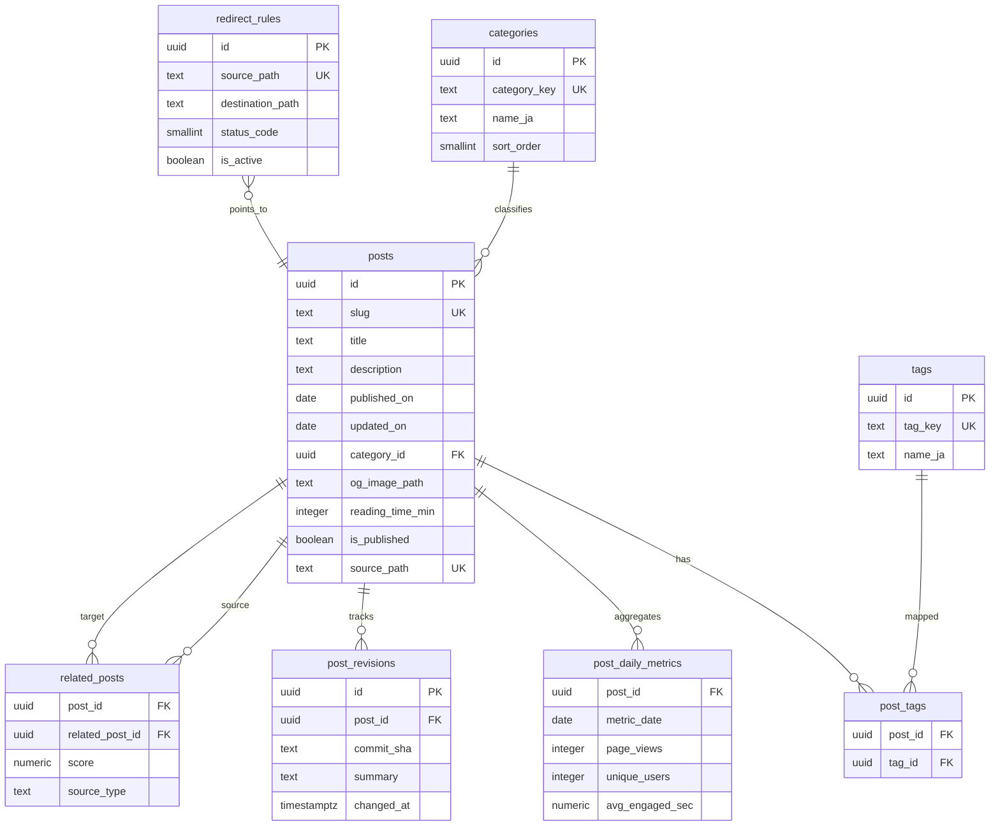

# データベース設計書

## 1. DB採用方針

- 本プロジェクトのMVPは、`content/blog/*.mdx` を正データとする **ファイルベース運用** を採用する。
- そのため、初期リリース時点ではアプリケーション必須のRDBは持たない。
- 一方で、人気記事ランキング自動化・運用管理機能・将来CMS化に備え、PostgreSQL（Supabase想定）での拡張設計を定義する。

## 2. データソース設計（MVP）

### 2.1 正データ
- `content/blog/*.mdx`（Git管理）

### 2.2 frontmatterスキーマ

| 項目 | 型 | 必須 | 制約 | 説明 |
|---|---|---|---|---|
| `title` | string | 必須 | 120文字以内推奨 | 記事タイトル |
| `description` | string | 必須 | 155文字以内推奨 | メタディスクリプション |
| `date` | string (YYYY-MM-DD) | 必須 | 公開日 | 記事公開日 |
| `updated` | string (YYYY-MM-DD) | 必須 | 更新日 | 記事更新日 |
| `category` | enum | 必須 | `tarot`/`kaiun`/`koyomi`/`moon`/`guide` | カテゴリ |
| `tags` | string[] | 任意 | 最大10件推奨 | タグ一覧 |
| `image` | string | 任意 | `/blog/images/...` | アイキャッチ画像 |
| `slug` | string | 必須 | サイト内一意・英小文字+ハイフン | URLパス識別子 |

### 2.3 バリデーション方針

- ビルド時にfrontmatter検証を実行し、必須項目欠落・slug重複はビルド失敗とする。
- `date <= updated` を必須ルールとする。
- `category` は許可済み値のみを受け付ける。

## 3. ER図（将来拡張: PostgreSQL）

## 4. テーブル定義（将来拡張）

### `categories`

| カラム名 | 型 | 制約 | 説明 |
|---|---|---|---|
| `id` | uuid | PRIMARY KEY, DEFAULT `gen_random_uuid()` | カテゴリID |
| `category_key` | text | UNIQUE, NOT NULL | `tarot`等の識別子 |
| `name_ja` | text | NOT NULL | 日本語表示名 |
| `sort_order` | smallint | NOT NULL, DEFAULT 0 | 表示順 |

**インデックス**: `uq_categories_key (category_key)`

**リレーション**: `posts.category_id` から参照される

### `posts`

| カラム名 | 型 | 制約 | 説明 |
|---|---|---|---|
| `id` | uuid | PRIMARY KEY, DEFAULT `gen_random_uuid()` | 記事ID |
| `slug` | text | UNIQUE, NOT NULL | URL slug |
| `title` | text | NOT NULL | 記事タイトル |
| `description` | text | NOT NULL | 記事概要 |
| `published_on` | date | NOT NULL | 公開日 |
| `updated_on` | date | NOT NULL | 更新日 |
| `category_id` | uuid | NOT NULL, FK | カテゴリID |
| `og_image_path` | text | NULL | OGP画像パス |
| `reading_time_min` | integer | NULL | 想定読了時間（分） |
| `is_published` | boolean | NOT NULL, DEFAULT true | 公開フラグ |
| `source_path` | text | UNIQUE, NOT NULL | 元MDXパス |
| `created_at` | timestamptz | NOT NULL, DEFAULT `now()` | 作成日時 |
| `updated_at` | timestamptz | NOT NULL, DEFAULT `now()` | 更新日時 |

**インデックス**:
- `uq_posts_slug (slug)`
- `idx_posts_category_published (category_id, published_on DESC)`
- `idx_posts_published (published_on DESC)`

**リレーション**:
- `categories (1) - (N) posts`
- `posts (1) - (N) post_tags`
- `posts (1) - (N) post_daily_metrics`

### `tags`

| カラム名 | 型 | 制約 | 説明 |
|---|---|---|---|
| `id` | uuid | PRIMARY KEY, DEFAULT `gen_random_uuid()` | タグID |
| `tag_key` | text | UNIQUE, NOT NULL | タグ識別子 |
| `name_ja` | text | NOT NULL | 日本語表示名 |

**インデックス**: `uq_tags_key (tag_key)`

**リレーション**: `post_tags.tag_id` から参照

### `post_tags`

| カラム名 | 型 | 制約 | 説明 |
|---|---|---|---|
| `post_id` | uuid | NOT NULL, FK | 記事ID |
| `tag_id` | uuid | NOT NULL, FK | タグID |
| `created_at` | timestamptz | NOT NULL, DEFAULT `now()` | 登録日時 |

**インデックス**:
- `pk_post_tags (post_id, tag_id)`
- `idx_post_tags_tag (tag_id)`

**リレーション**: `posts` と `tags` の中間テーブル

### `post_daily_metrics`

| カラム名 | 型 | 制約 | 説明 |
|---|---|---|---|
| `post_id` | uuid | NOT NULL, FK | 記事ID |
| `metric_date` | date | NOT NULL | 集計日 |
| `page_views` | integer | NOT NULL, DEFAULT 0 | PV |
| `unique_users` | integer | NOT NULL, DEFAULT 0 | UU |
| `avg_engaged_sec` | numeric(8,2) | NULL | 平均エンゲージ秒 |
| `created_at` | timestamptz | NOT NULL, DEFAULT `now()` | 作成日時 |

**インデックス**:
- `pk_post_daily_metrics (post_id, metric_date)`
- `idx_post_daily_metrics_date (metric_date DESC)`

**リレーション**: `posts (1) - (N) post_daily_metrics`

### `post_revisions`

| カラム名 | 型 | 制約 | 説明 |
|---|---|---|---|
| `id` | uuid | PRIMARY KEY, DEFAULT `gen_random_uuid()` | リビジョンID |
| `post_id` | uuid | NOT NULL, FK | 記事ID |
| `commit_sha` | text | NOT NULL | Gitコミット識別子 |
| `summary` | text | NULL | 変更要約 |
| `changed_at` | timestamptz | NOT NULL, DEFAULT `now()` | 変更日時 |

**インデックス**: `idx_post_revisions_post_changed (post_id, changed_at DESC)`

**リレーション**: `posts (1) - (N) post_revisions`

### `related_posts`

| カラム名 | 型 | 制約 | 説明 |
|---|---|---|---|
| `post_id` | uuid | NOT NULL, FK | 元記事ID |
| `related_post_id` | uuid | NOT NULL, FK | 関連記事ID |
| `score` | numeric(4,3) | NOT NULL, DEFAULT 0.5 | 関連度スコア |
| `source_type` | text | NOT NULL, DEFAULT `auto` | `auto` / `manual` |
| `created_at` | timestamptz | NOT NULL, DEFAULT `now()` | 作成日時 |

**インデックス**:
- `pk_related_posts (post_id, related_post_id)`
- `idx_related_posts_related (related_post_id)`

**リレーション**: `posts` への自己参照（N:N）

### `redirect_rules`

| カラム名 | 型 | 制約 | 説明 |
|---|---|---|---|
| `id` | uuid | PRIMARY KEY, DEFAULT `gen_random_uuid()` | ルールID |
| `source_path` | text | UNIQUE, NOT NULL | 旧URLパス |
| `destination_path` | text | NOT NULL | 新URLパス |
| `status_code` | smallint | NOT NULL, DEFAULT 301 | リダイレクト種別 |
| `is_active` | boolean | NOT NULL, DEFAULT true | 有効フラグ |
| `created_at` | timestamptz | NOT NULL, DEFAULT `now()` | 作成日時 |

**インデックス**: `uq_redirect_rules_source (source_path)`

**リレーション**: 必要に応じて`posts.slug`との整合をアプリ側で検証

## 5. マイグレーション計画

1. **M0（現行）**: DBなしでMDX運用を開始し、frontmatterバリデーションで整合性を担保。
2. **M1（拡張基盤）**: PostgreSQLに`categories`/`posts`/`tags`/`post_tags`を追加。
3. **M2（分析対応）**: `post_daily_metrics`を追加し、GA4集計の夜間バッチ反映を開始。
4. **M3（運用対応）**: `related_posts`と`redirect_rules`を追加し、関連記事管理と301運用をDB化。
5. **M4（監査対応）**: `post_revisions`を追加し、変更履歴トレーサビリティを確保。

## 6. 非機能・運用上の注意

- MVPではRDB接続が無いため、障害ポイントを減らしつつ高速配信を優先する。
- DB導入時は接続プール上限とクエリキャッシュ方針を合わせて設定する。
- 個人情報は保持しない方針を継続し、分析は集計データ中心で扱う。
